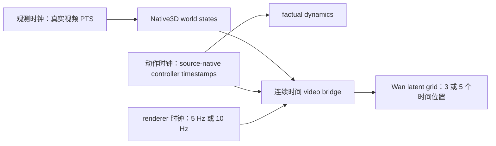
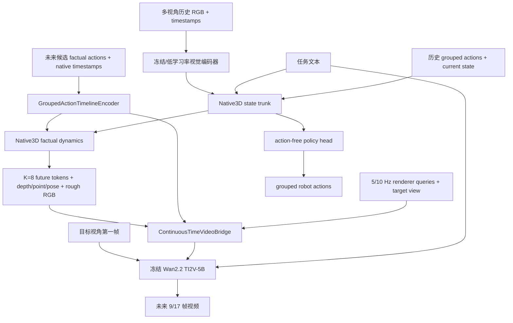

# WM3D-WAM v1 完整设计方案

| 项目 | 内容 |
|---|---|
| 状态 | 设计冻结候选 |
| 日期 | 2026-08-19 |
| 目标仓库 | `wxqnl/WM3D-WAM` |
| 当前分支 | `codex/design-wm3d-wam-v1` |
| 目标模型 | Native3D 世界状态模型 + Wan2.2 TI2V-5B 动作条件视频渲染器 |
| v1 预测范围 | 1.6 秒 |
| v1 视频时钟 | 5 Hz / 9 帧，10 Hz / 17 帧 |
| 训练设备 | New-H100-2 的 GPU 1–7；GPU 0 禁用 |

## 1. 最终决策

WM3D-WAM 使用新的空仓库作为唯一代码入口。服务器上当前 Native3D 的稳定数据 ABI、模型核心和分布式训练组件会被选择性迁入；Worldscape-MoE 与 GitHub 上较旧的 `world_model` 仓库只作为参考，Wan2.2 连接层重新实现。

v1 的关键决定如下：

1. Native3D 仍是世界状态、3D 几何和动作策略的唯一所有者；Wan 只负责把预测的世界状态渲染成视频。
2. 统一的是物理时间范围，不是所有数据源的整数帧率。预测范围固定为 1.6 秒，视频使用两个离散桶：5 Hz 的 9 帧和 10 Hz 的 17 帧。
3. 动作不重采样到视频 FPS。所有 source-native 动作值、时间戳、维度、坐标系和 mask 原样进入连续时间动作编码器。
4. Native3D 保持 `T_state=16`、3.2 秒历史和 `K_state=8`、1.6 秒未来；视频分支只使用一帧视觉上下文，随后预测 8 或 16 帧未来图像。
5. v1 不上多专家路由。当前训练数据都是低维机器人控制，差异主要来自 embodiment、控制器语义和时钟，而不是 Worldscape 中的相机轨迹、动作图、单臂和双臂四类完全不同的控制接口。
6. Wan VAE、T5 和 Wan 主干先冻结；训练零初始化的视频控制残差和连续时间动作注入。只有在动作跟随门禁明确失败时，才开启 Wan FFN 专家或 LoRA，不把它们放进首个正式方案。
7. 训练分为 Native3D 迁移校准、冻结世界核心的视频适配、有限联合对齐三段，总预算默认 90K optimizer steps。

这个选择保留了原 WM3D 已经解决的多视角、真实时间戳、source-native 动作、策略防泄漏和 3D 输出，同时吸收 Worldscape-MoE 在视频窗口、条件注入、渐进训练和离线 VAE 上已经验证过的工程经验。

## 2. 目标与边界

### 2.1 v1 必须完成

- 输入多视角历史、任务文本和一段候选动作，预测未来 1.6 秒的 native world tokens、RGB、depth、point、camera pose 和目标视角视频。
- 保留原有 action policy 输出，使系统既能评估外部候选动作，也能自己提出动作。
- 同时支持 5、10、15、20 Hz 数据源，不伪造不存在的观测帧或动作点。
- 同时支持 7D、8D、12D、15D 等 source-native 控制向量，并通过 grouped robot ABI 显式记录语义和 mask。
- 支持主视角、第二外部视角和 wrist 视角缺失；缺失视角只做 mask，不复制画面冒充另一视角。
- 能在 7×H100 上用 BF16、FSDP full shard、activation checkpointing 正式训练。

### 2.2 v1 不做

- 不把 Wan 当作动作预测器。Wan 分支不产生 action logits，也不向 policy head 回传视频条件。
- 不在 v1 同时接相机轨迹、手部 action map 等新控制模态。
- 不追求 720p 或 24 FPS 训练。Wan 的预训练输出规格不是机器人数据的采样事实。
- 不把当前 11M 个窗口全部做成独立 latent 文件。
- 不用补帧、光流插值或末值复制来制造视频帧；动作末值也不用于填满固定 17 步输入。
- 不把 RoboCasa 视频当成可恢复模拟器状态。当前本地版本只有 MP4 和 Parquet，没有可用的 simulator replay 资产。

## 3. 从 Worldscape-MoE 学到的内容

### 3.1 官方材料能够确认的事实

| 维度 | Worldscape-MoE 的实际做法 |
|---|---|
| 基座 | Wan2.2 TI2V-5B；30 个 DiT block，hidden 3072，FFN 14336 |
| 视频压缩 | Wan2.2 VAE，时间×空间压缩为 `4×16×16`；输入帧数需满足 `4n+1` |
| 控制模态 | camera、14D dual-arm、dense action map、7D LIBERO |
| 公开数据 | 每种模态 5,000 个 demo 样本，共 20,000；不是完整训练集 |
| 窗口 | camera/action-map 默认最多 81 帧；dual-arm/LIBERO 使用 17 步动作窗口 |
| manifest | 每条样本可声明 `start_frame`、`window_size`、`video_sample_stride`、`video_sample_n_frames` |
| 动作处理 | dual-arm 14D；LIBERO 7D 先独立归一化，再补到 14D；使用分位数裁剪到 `[-1,1]` |
| 条件注入 | 相机走空间 control adapter；action map 走 VAE latent；低维动作经 MLP 加到时间调制路径 |
| MoE | 每个 DiT FFN 替换为 shared expert + control-specific expert；样本只在 shared 和对应控制 expert 间路由 |
| 初始化 | experts 从原 FFN 或 shared expert 复制；router 零初始化，起步时允许专家等权 |
| 目标 | flow matching，目标为 `noise - clean_latent`；不做动作回归 |
| 冻结策略 | VAE、T5、attention、输出头及未选中的 DiT 参数冻结；experts、router、action MLP、adapter 训练 |
| 学习率 | 新模块 `2e-5`；shared expert 和 camera adapter 为一半学习率 |
| 运行配置 | 8×80GB，micro-batch 1/GPU，gradient accumulation 4，BF16，FSDP，checkpointing |
| 离线 VAE | 官方 H20 参考配置约把单步时间降到在线编码的一半；不含一次性预处理时间 |

### 3.2 官方没有公开或不能据此推断的内容

- 官方论文和公开数据卡没有给出 dual-arm 训练视频的物理 FPS。`17×14D` 只能证明动作张量形状，不能证明它一定是 10 Hz 或 1.6 秒。
- 公开的 20K 数据只是 demo 子集，不能反推出完整训练集的源分布、小时数或采样权重。
- 公开 loader 会把过长动作等距抽成 17 步，把过短动作重复最后一步；这适合其固定接口，不适合我们的异构 source-native 控制。
- 截至本设计日期，官方 README 仍未提供可直接用于初始化的 Worldscape-MoE 训练权重。

### 3.3 采用与不采用

| 处理 | 内容 | 原因 |
|---|---|---|
| 采用 | 每条窗口显式记录帧索引、stride、帧数和控制类型 | 不把数据源差异藏进全局参数 |
| 采用 | 视频长度使用 `4n+1` | 与 Wan VAE 的时间压缩一致 |
| 采用 | 第一帧作为 TI2V reference | 适合机器人短时预测 |
| 采用 | frozen base + 零初始化残差 | 起步不破坏 Wan 和 Native3D 的已有能力 |
| 采用 | 新模块高学习率、继承模块低学习率 | 控制适配速度与先验保持之间更稳 |
| 采用 | 离线 VAE latent | 避免每个 epoch 重复解码和编码视频 |
| 不照搬 | 固定 17 步并做等距抽取/末值填充 | 会抹掉真实动作时钟 |
| 不照搬 | 一个模态共用一套 1%/99% 动作统计 | OXE/RoboCasa 的维度、单位、delta/absolute 语义不同 |
| 不照搬 | v1 直接复制多套 FFN expert | 当前只有机器人动作一种控制家族，7 卡成本不划算 |
| 不照搬 | 单视角数据模型 | WM3D 的价值之一就是多视角和显式 3D |
| 不照搬 | 每个窗口一个 latent 文件 | 600K 以上窗口会造成 inode 和随机读问题 |

## 4. 当前数据事实

### 4.1 权威输入

- 数据 profile：`/data/Minko/wm3d_formal_1b_raw_100k_3f056a4_20260816/data_profile.yaml`
- 当前 episode/window 统计：`/data/Minko/wm3d_async_cache_pilot_20260819/episode_window_counts.jsonl`
- 当前代码参考：`/data/Minko/wm3d_rgb_chunk16_code_20260819/wm3d`
- 旧 GitHub `world_model` clone 只作历史参考，不作为实现基线。

### 4.2 总量

| 家族 | source 数 | 原始 episode | train episode | 可用窗口 | 小时 | 正式 profile 权重 |
|---|---:|---:|---:|---:|---:|---:|
| OXE | 18 | 204,860 | 131,743 | 2,930,466 | 933.669 | 83.2% |
| RoboCasa365 | 3 | 568,073 | 415,639 | 8,104,302 | 2,018.787 | 16.8% |
| 合计 | 21 | 772,933 | 547,382 | 11,034,768 | 2,952.456 | 100% |

物理小时分布与当前采样权重并不相同：RoboCasa 占约 68.4% 小时，但当前 profile 只占约 16.8% 抽样权重。这一权重适合给 OXE 做强上采样，却不应原样套到每一个训练阶段。

### 4.3 source 明细

`分辨率`为 `H×W`；窗口数是当前 episode/window 统计中的可用总数。

| source | Hz | 分辨率 | action/state | train episode | 窗口 | 小时 | 视频桶 |
|---|---:|---:|---:|---:|---:|---:|---:|
| oxe_bridge | 5 | 256×256 | 7/8 | 21,112 | 128,148 | 105.168 | 5 Hz / 9f |
| oxe_droid | 15 | 180×320 | 8/8 | 84,907 | 2,107,539 | 511.674 | 5 Hz / 9f |
| oxe_utaustin_mutex | 20 | 128×128 | 7/8 | 1,458 | 17,737 | 5.026 | 10 Hz / 17f |
| oxe_stanford_hydra | 10 | 240×320 | 7/8 | 545 | 65,305 | 9.951 | 10 Hz / 17f |
| oxe_berkeley_autolab_ur5 | 5 | 480×640 | 7/8 | 973 | 20,301 | 5.441 | 5 Hz / 9f |
| oxe_austin_sailor | 20 | 128×128 | 7/8 | 234 | 31,787 | 4.904 | 10 Hz / 17f |
| oxe_austin_sirius | 20 | 84×84 | 7/8 | 543 | 14,964 | 3.888 | 10 Hz / 17f |
| oxe_berkeley_fanuc | 10 | 224×224 | 7/8 | 349 | 6,428 | 1.739 | 10 Hz / 17f |
| oxe_jaco_play | 10 | 224×224 | 7/8 | 900 | 5,454 | 2.166 | 10 Hz / 17f |
| oxe_fmb | 10 | 256×256 | 7/8 | 1,753 | 35,466 | 9.394 | 10 Hz / 17f |
| oxe_berkeley_cable | 10 | 128×128 | 7/8 | 113 | 303 | 1.176 | 10 Hz / 17f |
| oxe_roboturk | 10 | 480×640 | 7/8 | 1,383 | 15,712 | 5.209 | 10 Hz / 17f |
| oxe_dlr_edan | 5 | 360×640 | 7/7 | 99 | 1,793 | 0.496 | 5 Hz / 9f |
| oxe_austin_buds | 5 | 128×128 | 7/24 | 49 | 12,968 | 1.895 | 5 Hz / 9f |
| oxe_nyu_franka | 5 | 128×128 | 15/13 | 438 | 9,348 | 2.493 | 5 Hz / 9f |
| oxe_cmu_stretch | 5 | 128×128 | 8/4 | 132 | 6,251 | 1.390 | 5 Hz / 9f |
| oxe_furniture_bench | 10 | 224×224 | 7/8 | 2,413 | 263,198 | 109.668 | 10 Hz / 17f |
| oxe_bc_z | 10 | 171×213 | 7/8 | 14,342 | 187,764 | 151.991 | 10 Hz / 17f |
| robocasa_atomic | 20 | 256×256 | 12/16 | 6,121 | 64,104 | 20.768 | 10 Hz / 17f |
| robocasa_composite | 20 | 256×256 | 12/16 | 16,245 | 1,658,404 | 383.485 | 10 Hz / 17f |
| robocasa_mg | 20 | 256×256 | 12/16 | 393,273 | 6,381,794 | 1,614.534 | 10 Hz / 17f |

### 4.4 已知问题

1. 当前 adapter 把 action/state 多数标为笼统的 `controller_command/controller_state`，scale/offset 还是 identity。它能保留原始值，但不足以支持可信的跨 embodiment 参数共享。
2. RoboCasa 原始文件包含 left external、right external、eye-in-hand 三路视频；当前路径只稳定使用 left external 和 wrist，right external 没有进入主训练视图。
3. RoboCasa 本地快照没有 `states.npz`、XML 或 HDF5 replay 资产，不能把离线视频指标写成 simulator success。
4. DROID 和 BC-Z 分辨率偏低但规模大；128 或 84 像素的七个 OXE source 不适合直接监督 256 像素 Wan 输出。
5. 当前 episode cache 的 state frame selection 最小间隔为 0.2 秒，等价于最多 5 Hz。10 Hz 视频目标必须从原视频 PTS 另建 renderer sidecar，不能从这个 5 Hz state cache 反推。

## 5. 时间设计

### 5.1 三条时钟分开管理



- 观测时钟决定哪些真实帧可作为 world state 和视频监督。
- 动作时钟保留控制器实际采样，不与图像帧一一绑定。
- renderer 时钟只决定输出视频帧的时间点。

代码中禁止使用一个名为 `fps` 的全局值同时解释这三件事。

### 5.2 固定物理范围

| 路径 | 历史 | 未来 | 样本数 |
|---|---:|---:|---:|
| Native3D state | 3.2 s | 1.6 s | `T=16`, `K=8` |
| policy action query | 历史真实动作 | 1.6 s | source-native query timestamps |
| 5 Hz video | 第一帧 | 1.6 s | `1 + 8 = 9` 帧 |
| 10 Hz video | 第一帧 | 1.6 s | `1 + 16 = 17` 帧 |

9 和 17 都满足 Wan VAE 的 `4n+1` 条件。对应 latent 时间长度分别为 3 和 5。

### 5.3 视频桶规则

| source nominal Hz | renderer Hz | 原始步进 | 帧数 | 选择原因 |
|---:|---:|---:|---:|---|
| 5 | 5 | 1 | 9 | 不补帧 |
| 10 | 10 | 1 | 17 | 保留原始运动 |
| 15 | 5 | 3 | 9 | 15→10 不能做整数步抽样；15→5 可保持真实帧 |
| 20 | 10 | 2 | 17 | 保留较高时间分辨率，成本低于 20 Hz |

实际选择以 PTS 为准，nominal Hz 只决定候选桶。窗口生成器执行以下规则：

1. anchor 必须是原始观测行，时间记为 `t0`。
2. 目标 renderer 时间为 `t0 + j / video_hz`。
3. 优先按整数原始步进选择；存在抖动时，只允许选单调且不重复的最近真实帧。
4. 每个选中帧与目标时刻的误差不得超过一个 renderer 间隔的 25%；末帧覆盖不得低于 90%。阈值在全量 PTS audit 后只允许收紧，不允许为了增加样本而放宽。
5. 任一条件不满足，整条窗口标为 renderer-invalid；它仍可用于 Native3D/action 训练。
6. 不做 RGB 插帧，不伪造动作点，不把最后一个动作复制到窗口尾部。

### 5.4 为什么不用 24 Hz 或单一 10 Hz

Wan 的 24 FPS 是预训练和默认推理规格，不是现有机器人数据的采样率。把 5–20 Hz 数据上采到 24 Hz 只会让模型学习插值器伪影。

单一 10 Hz 会迫使 5 Hz 数据补帧，也会让 15 Hz 数据在 1/2 帧间隔之间抖动。单一 5 Hz 虽然最简单，却会丢掉占大多数小时数的 10/20 Hz 运动细节。两个桶是当前数据和算力下最小且足够的集合。

### 5.5 动作时间线

每条窗口保留 `t0` 到 `t0+1.6s` 之间所有真实 action rows：

- `fine_action_values[S,G,D]`
- `fine_action_mask[S,G,D]`
- `fine_action_times_s[S]`
- `fine_action_dt[S]`
- `group_ids[G]`
- `action_semantic_ids[G,D]`
- `embodiment_id`

`S` 可变，上限沿用 Native3D 的 128 个 action substeps。视频第 `j` 个时间查询只允许看到 `action_time <= renderer_time_j` 的动作 token。生成整段视频时模型知道完整 action plan，但每个视觉时间位置的 cross-attention mask 仍保持因果方向。

## 6. 空间与多视角设计

### 6.1 空间桶

| 桶 | 输出大小 `H×W` | 主要数据 |
|---|---:|---|
| square | 256×256 | RoboCasa、Bridge、FMB、224/256 方形源 |
| landscape | 192×256 | 4:3、5:4、接近横向的源 |
| wide | 160×288 | DROID 等接近 16:9 的源 |

所有边长均为 16 的倍数，满足 Wan VAE 空间压缩。处理顺序为按短边等比缩放，再做确定性 crop；同一窗口的全部帧使用完全相同的 crop 参数。训练阶段不做会改变物体位置语义的随机大裁剪。

### 6.2 视频质量分层

| tier | 原始短边 | Wan loss 权重 | 使用方式 |
|---|---:|---:|---|
| A | `>=224` | 1.0 | 正常视频训练 |
| B | `160–223` | 0.5 | DROID、BC-Z；保留但降低像素监督权重 |
| C | `<160` | 0.0 | 只训练 Native3D/action，不进入 v1 Wan 正式集 |

Tier C 不是永久删除。只有在 128 像素独立对照证明不会拖低清晰度后，才允许加入低分辨率视频桶。

### 6.3 视角 ABI

新项目把三个槽位改成角色而不是机器人身体部位：

1. `primary_external`
2. `secondary_external`
3. `wrist`

迁移时逐 source 审计映射。RoboCasa 明确映射 left external、right external、eye-in-hand；其他 source 不根据列名猜测语义，沿用已人工确认的 adapter 或重新确认。

Native3D 一次读取所有可用视角。Wan 每条训练样本只渲染一个目标视角，并附加 `target_view_role` embedding：

- primary：50%
- secondary：25%
- wrist：25%

若某角色缺失，在剩余角色内重新归一化。推理时可以对同一 world/action latent 分别运行多个目标视角；三路视频共享 Native3D 的 3D 预测，因此不会通过拼接画面假装多视角一致性。

## 7. 新数据合同

### 7.1 window manifest

每行是一个语义可读的窗口，不用摘要字符串充当 identity：

```yaml
schema: wm3d_wam_window_v1
window_id: robocasa_mg/episode_012345/window_0007
source: robocasa_mg
episode_id: episode_012345
split: train
task_text: pick up the mug and place it in the cabinet
embodiment: robocasa_panda_omron

world:
  anchor_row: 126
  context_indices: [62, 66, 70, 74, 78, 82, 86, 90, 94, 98, 102, 106, 110, 114, 120, 126]
  future_indices: [130, 134, 138, 142, 146, 150, 154, 158]
  context_times_s: [...]
  future_times_s: [...]

video:
  rate_bucket_hz: 10
  frame_indices: [126, 128, 130, 132, 134, 136, 138, 140, 142, 144, 146, 148, 150, 152, 154, 156, 158]
  frame_times_s: [...]
  size_bucket: square_256
  available_view_roles: [primary_external, secondary_external, wrist]
  quality_tier: A

robot:
  action_clock: source_controller_native
  action_row_start: 126
  action_row_stop: 159
  group_contract: robocasa_panda_omron_v1
  normalization_group: robocasa_panda_omron_action_v1
```

路径只相对 source root 存储。split 固定在 episode 级，任何同一 episode 的窗口不得跨 train/val/test。

### 7.2 action adapter 合同

每个 source 必须显式给出：

- action/state 列和精确维度；
- 每一维是 absolute、delta、velocity、binary 还是 gripper；
- 单位、坐标系、旋转表示、组合算子和 gripper 极性；
- action 与 observation 的 leading/trailing 对齐关系；
- per-source 或 per-embodiment 归一化统计；
- 不可比较维度的独立 semantic id。

连续维使用训练 split 的稳健中心和尺度，裁剪只发生在送入网络的 normalized copy；原值永久保留。binary/gripper 不做连续归一化。尚未完成语义确认的 source 可以作为 `opaque_source_native` 训练同源 factual dynamics，但不得进入跨 embodiment action sharing 指标。

### 7.3 采样层级

每个 optimizer micro-step 按以下顺序抽样：

```text
训练阶段
→ 数据家族 OXE / RoboCasa
→ source
→ temporal × spatial bucket
→ episode
→ valid window
→ target view
```

先选 episode、再选 window，避免单个超长 episode 按窗口数无限放大。一个 global batch 的 7 个 rank 使用同一 temporal/spatial bucket，保证 Wan shape 一致；source 和 episode 可以不同。

## 8. 缓存与存储

### 8.1 两级缓存

**Level 1：episode cache**

沿用 Native3D 的 episode 级 RGB、native tokens、depth、point、pose、action/state 和真实时间戳。当前 5 Hz state selection 仍服务 Native3D；renderer 额外从原视频 PTS 读取 10 Hz 帧。

**Level 2：Wan sidecar**

只为固定训练 window plan 预计算：

- target video VAE latent；
- first-frame TI2V condition latent；
- renderer frame indices/timestamps/crop；
- target view role；
- task embedding 引用；
- action timeline 引用。

### 8.2 shard 方案

- 初始物化 600K 个 video-eligible train windows：OXE 450K，RoboCasa 150K。
- 按 `rate_bucket × size_bucket × target_view` 分组。
- 每 512 个同 shape 样本写一个 safetensors shard，并配一个 JSONL index。
- task embedding 按规范化任务文本去重存一次，不复制到每个 window。
- 不生成 600K 个小文件，不把 11M 个候选窗口全部预编码。
- 初始 sidecar 硬预算 150 GB，放在 42 本地 `/data`；不写入只剩较少空间的 `/shared`。
- 预处理可断点续跑，完成标记只在整个 shard 写完并能重新打开后发布。

42 当前 `/data` 约有 2.0 TB 可用，足够放首批 sidecar、checkpoint 和日志；`/shared` 只作为 OXE 原始数据读取路径。

### 8.3 为什么离线 VAE 是正式路径

Worldscape 官方在 H20 上报告离线 VAE 约 2× step throughput。我们的数据规模远大于其 20K demo，在线反复 decode/VAE 的浪费更大。正式训练默认读取 sidecar；上线前仍做 200-step online/offline 对照，记录真实 samples/s、GPU memory 和 dataloader wait，最终容量按实测修订。

## 9. 模型架构

### 9.1 总体结构



### 9.2 Native3D

选择性迁入当前 `NativeWorldModel v2`：

- 16 个历史 state positions；
- 8 个 future world queries；
- 三视角 token fuser；
- continuous-time Fourier embedding；
- grouped action/current-state ABI；
- action-free policy lane；
- factual-action dynamics lane；
- native RGB、depth、point、camera pose heads。

不迁入旧项目的大量一次性实验配置、历史训练脚本和 benchmark 兼容分支。

### 9.3 GroupedActionTimelineEncoder

视频分支不再使用固定 `action_dim=7/14` MLP。编码器输入 grouped values、semantic ids、embodiment id、真实时间和 mask，输出两类 token：

1. `action_event_tokens[S,H]`：每个真实 controller event 一个 token；
2. `action_interval_tokens[K,H]`：按 Native3D 的 8 个未来 state interval 汇聚，供 factual dynamics 使用。

时间编码用秒，不用数组下标。不同 group 共享骨干，但 semantic 和 embodiment embedding 分开，避免把 7D Panda 的第 1 维和 12D RoboCasa 的第 1 维当成同一物理量。

### 9.4 ContinuousTimeVideoBridge

bridge 为 Wan latent 的每个目标时间位置建立 query：5 Hz 视频有 3 个 latent-time queries，10 Hz 视频有 5 个。每个 query cross-attend：

- 8 个 Native3D future world states 及其真实时间；
- target view 的 depth/point/pose/rough RGB features；
- 截止该时间点可见的 action event tokens；
- task embedding 和 target-view embedding。

输出是与 Wan latent grid 对齐的 control volume，以及低维 action tokens。world states 到 latent time 的映射由 attention 学习并读取连续时间差，不对 action values 做线性插值。

### 9.5 Wan 注入

Wan 保留原生 first-frame TI2V 和文本 cross-attention。新增两条零初始化残差：

1. `world_control_residual`：control volume 经过 3D conv/projector 后，在 30 个 DiT block 的 self-attention 输出后加入；每层有独立小输出投影和可学习 gate。
2. `action_cross_residual`：video tokens 对 action event tokens 做 masked cross-attention，在同一 block 内加入；输出投影零初始化。

不改 Wan 原有 attention、FFN、norm 和输出头。初始 forward 与冻结 Wan 完全一致；训练只逐步打开控制残差。

### 9.6 输出与梯度所有权

| 输出 | 唯一所有者 | 视频 loss 是否可更新 |
|---|---|---|
| policy action | Native3D action-free policy | 否 |
| native future tokens | Native3D factual dynamics | Stage B 否，Stage C 是 |
| depth/point/pose | Native3D geometry heads | Stage B 否，Stage C 是 |
| rough native RGB | Native3D RGB head | Stage B 否，Stage C 是 |
| final video | Wan + WAM adapters | 是 |

policy lane 永远不读取 future factual actions、Wan hidden states 或 target video latent。这个边界由 module API 保证，不依赖训练脚本里临时 `detach`。

### 9.7 v1 不使用 MoE 的原因

Worldscape 的 MoE 解决的是控制接口之间的结构差异。我们当前 21 个 source 都属于机器人低维控制，已经有 grouped semantic、embodiment 和独立 normalization。先把数据语义和时间做对，比复制 30 组大 FFN 更重要。

以下任一情况出现后再立项 MoE：

- 新增 camera trajectory 或 dense action map；
- source-level 梯度冲突长期集中在相同 block；
- dense adapter 在同等数据下显著落后于单-source 上限；
- action-following 门禁不通过，而增加 action adapter 宽度也无效。

届时采用 `frozen/shared + control expert` 的 copy initialization，不从随机 expert 开始。

## 10. 训练方案

### 10.1 Phase 0：代码与资产迁移

1. 从当前 WM3D 代码选择性迁入 data contract、grouped robot、window selection、NativeWorldModel、FSDP runtime 和 checkpoint loader。
2. 重写 view roles 和 action adapter contracts，不搬旧配置墓地。
3. 生成 dual-rate renderer window index，并物化 600K Wan sidecar。
4. 准备 Wan2.2 TI2V-5B 权重。42 当前只有 `/data/Minko/external/Wan2.2` 代码，预期模型权重目录尚不存在；通过可访问的镜像或共享存储离线放入，不在训练时临时下载。
5. 现存可见的 Native3D 100K checkpoint 候选是 `/data/Minko/world_model/wm3d_v5/results/wm3d_v5_p64_1b_stage0_native3d_hunyuan_rgb_fromscratch_full8ep_2node_v1/ckpt/step_00100000.pt`。它只能在名称/shape 覆盖完整且 forward contract 一致时作为 warm start；不允许静默漏载。

### 10.2 训练阶段总表

| 阶段 | 默认 steps | OXE:RoboCasa | 训练模块 | 冻结模块 | 主要目标 |
|---|---:|---:|---|---|---|
| A Native calibration | 30K | 40:60 | action adapters、action trunk/head、factual dynamics、native output heads | 视觉/文本 encoder、state trunk 前部 | 新 grouped 语义和真实时钟适配 |
| B WAM adapter | 40K | 75:25 | video bridge、world residual、action cross residual、view embedding | 全部 Native3D、Wan、VAE、T5 | action-conditioned flow matching |
| C Joint alignment | 20K | 65:35 | Stage B 模块 + Native factual dynamics/geometry/RGB heads | policy lane、Wan base、VAE、T5、Native state prior | 3D 与视频对齐，不破坏策略 |

若 v5 100K checkpoint 不能完整迁移，Stage A 改为 100K from-scratch 预训练；B/C 不变。这个分支在 Phase 0 结束时一次性决定，不能在训练中途换初始化来源。

RoboCasa 内部固定为 atomic/composite/MG = 10/60/30。OXE 内部从当前 source weights 起步；Stage B 再乘视频质量系数 A=1、B=0.5、C=0，并把任一 source 在 OXE 内的占比封顶为 25%。

### 10.3 学习率与 optimizer

| 参数组 | Stage A | Stage B | Stage C |
|---|---:|---:|---:|
| 新 action adapter / WAM action residual | `2e-5` | `2e-5` | `1e-5` |
| WAM world bridge/residual | — | `1e-5` | `1e-5` |
| Native factual dynamics / heads | `1e-5` | 0 | `5e-6` |
| Native policy trunk/head | `1e-5` | 0 | 0 |
| Native state prior | 0 | 0 | 0 |
| Wan base / VAE / T5 | 0 | 0 | 0 |

- AdamW，betas `(0.9, 0.95)`。
- WAM adapter weight decay 0；Native trainable weights 0.01。
- linear warmup 500 steps，之后 cosine decay 到峰值的 10%。
- global grad norm 1.0；BF16。
- 不启用自动 learning-rate scaling，7 卡配置使用表中绝对值。

### 10.4 loss

**Stage A**

- native token MSE + cosine；
- RGB Charbonnier + gradient + perceptual；
- depth log、point、camera pose；
- grouped fine/coarse action loss；
- 不定义跨 source 的 action velocity loss。

**Stage B/C**

Wan 使用 flow matching：

```text
z_sigma = (1 - sigma) * z_video + sigma * epsilon
target  = epsilon - z_video
loss    = weighted_mse(model(z_sigma, conditions), target)
```

第一帧由 TI2V condition 提供，对应的首个 latent-time position 不计生成 loss。未来 latent 计 loss。10% action-condition dropout 和 10% text dropout 用于 classifier-free guidance；world control 不 dropout，避免训练成普通 I2V。

v1 不默认加入没有真实反事实标签的“动作必须产生差异”损失。动作是否被使用由成对 counterfactual 评测门禁判断；若 Stage B 失败，再按失败原因增加有监督约束，不先写一个可能鼓励错误运动的损失。

### 10.5 分布式配置

```text
CUDA_VISIBLE_DEVICES=1,2,3,4,5,6,7
nproc_per_node=7
micro_batch_per_gpu=1
gradient_accumulation_steps=4
effective_global_batch=28
precision=bf16
fsdp=full_shard
activation_checkpointing=true
```

GPU 0 在 preflight 和 launcher 中都列为 forbidden device。任何程序发现 local rank 映射到物理 0 直接退出。

正式步数前先跑：

1. 20-step 单卡 shape/gradient canary；
2. 200-step 七卡 online-VAE benchmark；
3. 200-step 七卡 offline-VAE benchmark；
4. 300-step 七卡训练 canary；
5. 通过门禁后启动正式阶段。

这些是同一训练路径的短运行，不维护第二套简化模型。

### 10.6 checkpoint 与恢复

- 使用编号 checkpoint；不使用 `latest` 软链接作为正式恢复输入。
- 每个阶段保留 `300 / 1K / 5K / 10K / final` 里程碑。
- 保存 model、optimizer、scheduler、sampler cursor、RNG 和当前 bucket plan。
- Stage 间迁移重置 optimizer；同 Stage 中断恢复必须恢复全部状态。
- 不在训练脚本里自动删除旧 checkpoint；容量不足时由操作者明确处理。

## 11. 评测与放行门禁

### 11.1 固定评测切片

评测集按 episode 固定，至少包含：

- 每个 source 的 in-domain val；
- OXE 与 RoboCasa 两个家族；
- 5 Hz/9f 与 10 Hz/17f；
- square/landscape/wide；
- primary/secondary/wrist；
- 静止、低运动、高运动、gripper transition、接触事件；
- 7D/8D/12D/15D action；
- Tier A 与 Tier B。

每个大 source 固定 200 个窗口；不足 200 的 source 使用全部 val 窗口。报告 macro source average 和按正式采样权重的 weighted average，两者都保留。

### 11.2 指标

| 能力 | 指标 |
|---|---|
| Native world | token MSE/cosine、depth AbsRel、point Chamfer、pose rotation/translation error |
| 单帧视频 | PSNR、SSIM、LPIPS、DINO/JEPA similarity |
| 时序 | FVD、光流 EPE、temporal LPIPS、motion smoothness |
| 动作跟随 | true-action 与 zero/time-shift/gripper-toggle action 的 GT distance margin |
| 视角 | 各 view-role 独立指标；共享 3D warp consistency（有几何时） |
| 长滚动 | 4×1.6s autoregressive rollout 的 identity、背景和 motion drift |
| policy | normalized continuous error、binary/gripper F1、按 source/group 的 macro average |

反事实 action following 定义为：同一个 anchor 和文本分别输入真实动作与错误动作，真实动作生成结果必须比错误动作更接近 ground-truth future。报告 margin 的 bootstrap 95% 区间，不把“两个视频看起来不同”当作动作正确。

### 11.3 阶段门禁

**Stage A → B**

- 所有 source 的 loss finite；
- action-free policy 路径无法读取 future factual action；
- Native3D 主要指标相对迁移前基线的退化不超过 2%；
- 新 action adapter 在每种维度族都有非零梯度和有效样本。

**Stage B → C**

- 视频优于 first-frame hold baseline 和未适配 Wan I2V baseline；
- OXE、RoboCasa、5 Hz、10 Hz 四个主切片的 true-action margin 都为正，且区间下界不低于 0；
- primary 与 wrist 都有有效提升，不能只靠单一视角通过；
- 没有因 sidecar miss 静默替换到别的 source/window。

**Stage C → v1 release**

- Native 3D 与 policy 指标相对 Stage A 退化不超过 3%；
- 视频 macro average 优于 Stage B，且 OXE/RoboCasa 任一家族不能明显倒退；
- 4 段 rollout 没有系统性静止、动作提前、末帧复制或 wrist 视角崩溃；
- 七卡独立进程 exact resume 后的下一步数据 cursor、loss 和 optimizer 状态一致。

如果 action margin 不通过，依次排查 action semantic、时间 mask、bridge 注入强度和 adapter 容量。只有前面三项正确后，才试 Wan FFN robot expert 或 LoRA。

## 12. 仓库结构

```text
WM3D-WAM/
├── README.md
├── docs/
│   ├── WM3D_WAM_V1_DESIGN.md
│   ├── DATA_CONTRACT.md
│   ├── TRAINING.md
│   └── EVALUATION.md
├── configs/
│   ├── data/current_oxe_robocasa.yaml
│   ├── temporal/video_5hz_9f.yaml
│   ├── temporal/video_10hz_17f.yaml
│   ├── model/native_1b.yaml
│   ├── model/wan_ti2v_5b.yaml
│   └── train/{stage_a_native,stage_b_wam,stage_c_joint}.yaml
├── wm3d_wam/
│   ├── data/
│   │   ├── manifest.py
│   │   ├── grouped_robot.py
│   │   ├── temporal_windows.py
│   │   ├── source_adapters.py
│   │   ├── bucket_sampler.py
│   │   └── wan_latent_cache.py
│   ├── models/
│   │   ├── native_world_model.py
│   │   ├── grouped_action_timeline.py
│   │   ├── continuous_time_video_bridge.py
│   │   ├── wan_control_adapter.py
│   │   └── system.py
│   ├── training/
│   │   ├── stage_a_native.py
│   │   ├── stage_b_wam.py
│   │   ├── stage_c_joint.py
│   │   ├── distributed.py
│   │   └── checkpoint.py
│   └── evaluation/
│       ├── native_metrics.py
│       ├── video_metrics.py
│       ├── action_following.py
│       └── rollout.py
├── scripts/
│   ├── audit_data.py
│   ├── build_window_index.py
│   ├── precompute_wan_latents.py
│   ├── train.py
│   └── evaluate.py
├── tests/
└── third_party/NOTICE.md
```

不创建假的空实现。文件只在对应功能进入当前里程碑时加入。

## 13. 迁入与重写清单

### 13.1 从当前 WM3D 迁入

- grouped robot schema 和 tensor packing；
- source adapter/inventory 基础；
- observed monotonic window selection；
- NativeWorldModel v2 主体；
- FSDP2/DDP runtime、activation checkpointing 和编号 checkpoint；
- native losses 与 offline evaluation 基础。

### 13.2 必须重写

- temporal window：新增 renderer clock 和 5/10 Hz buckets；
- view ABI：`primary_external/secondary_external/wrist`；
- action contract：补齐 per-dimension semantic、单位、frame、gripper polarity；
- Wan adapter：删除固定 7D/14D 和 index positional encoding，改为 grouped continuous time；
- latent cache：从 per-window 小文件改为 shape-homogeneous shards；
- sampler：实现 family/source/episode/bucket/view 分层抽样；
- system API：硬隔离 policy lane 与 factual/video lane。

### 13.3 只参考、不复制

- Worldscape 的多模态 MoE router；
- 其通用 image/video loader 的 retry 行为；
- 其 81-frame camera/action-map 分支；
- 旧 WM3D 里大量 stage 编号实验配置和 benchmark 特例。

若实际复制 Apache-2.0 代码片段，必须在 `third_party/NOTICE.md` 标出来源并保留许可证；仅按论文思想重新实现则记录参考链接。

## 14. 实施顺序

### M0：设计冻结

- 本文评审通过；
- 确定 v1 只做 robot action；
- 确定 dual-rate 与三类空间桶。

### M1：数据合同

- 迁入 manifest/grouped ABI；
- 完成 21 个 source 的 action/view 语义 audit；
- 生成 dual-rate window index；
- 输出各 source 的 invalid reason 分布。

### M2：Native3D 迁移

- 迁入最小模型和训练 runtime；
- 对 checkpoint 候选做完整兼容判断；
- 跑 Stage A canary 和正式训练。

### M3：WAM

- 接入官方 Wan2.2 TI2V-5B；
- 实现 continuous-time bridge 与两条 residual；
- 物化 600K sidecar；
- 跑 Stage B。

### M4：联合与评测

- 解冻 factual dynamics 和 native heads；
- 跑 Stage C；
- 完成 action counterfactual、multi-view 和 6.4s rollout；
- 决定是否需要 FFN expert/LoRA 的下一版实验。

## 15. 主要风险

| 风险 | 影响 | 处理 |
|---|---|---|
| action 语义仍是 opaque | 跨 source 共享会产生错误梯度 | source 级合同；未确认 source 只做同源 factual dynamics |
| Wan 忽略动作 | 视频看起来好但不可控 | 因果 action cross-attn、true-vs-counterfactual GT margin 门禁 |
| 10 Hz 侧缓存不完整 | 高速数据退化成 5 Hz | 从原视频 PTS 建 sidecar，不从 5 Hz state cache 推导 |
| RoboCasa MG 主导 | 模型记住单一模拟分布 | family/source/episode 分层；RC 内 10/60/30 |
| 低分辨率大源拖低画质 | 模糊、边缘伪影 | Tier B 半权重，Tier C v1 不做 Wan loss |
| 7 卡不足以训练复制 FFN expert | OOM 或 optimizer 过大 | v1 adapter-only；FSDP full shard；容量升级放在门禁之后 |
| Native 与视频联合互相破坏 | 3D/策略退化 | Stage B 全冻结，Stage C 只开 factual dynamics/heads，policy 永久隔离 |
| Wan 权重当前不在 42 | 无法开始 Stage B | Phase 0 离线放入本地或共享只读模型目录 |
| 旧 checkpoint 不兼容 | 无法可靠 warm start | 完整迁移或 100K from-scratch；禁止部分静默加载 |

## 16. 设计冻结后的默认配置

```yaml
project: wm3d_wam_v1

time:
  context_horizon_s: 3.2
  future_horizon_s: 1.6
  native_context_states: 16
  native_future_states: 8
  interpolation: forbidden
  video_buckets:
    - source_hz: [5, 15]
      renderer_hz: 5
      frames: 9
      latent_frames: 3
    - source_hz: [10, 20]
      renderer_hz: 10
      frames: 17
      latent_frames: 5

video:
  model: Wan2.2-TI2V-5B
  spatial_buckets: [[256, 256], [192, 256], [160, 288]]
  context_frames: 1
  target_views: [primary_external, secondary_external, wrist]
  freeze_vae: true
  freeze_text_encoder: true
  freeze_wan_base: true

runtime:
  visible_gpus: [1, 2, 3, 4, 5, 6, 7]
  forbidden_gpus: [0]
  precision: bf16
  fsdp: full_shard
  micro_batch_per_gpu: 1
  gradient_accumulation_steps: 4
  effective_global_batch: 28

training:
  stage_a_steps_if_warm_start: 30000
  stage_a_steps_if_from_scratch: 100000
  stage_b_steps: 40000
  stage_c_steps: 20000
  family_mix:
    stage_a: {oxe: 0.40, robocasa: 0.60}
    stage_b: {oxe: 0.75, robocasa: 0.25}
    stage_c: {oxe: 0.65, robocasa: 0.35}
  robocasa_mix: {atomic: 0.10, composite: 0.60, mg: 0.30}
```

## 17. 参考

- [Worldscape-MoE 论文](https://arxiv.org/abs/2607.03964)
- [Worldscape-MoE 官方代码](https://github.com/EmbodiedCity/Worldscape-MoE.code)
- [Worldscape-MoE 公开数据卡](https://huggingface.co/datasets/EmbodiedCity/Worldscape-MoE-Dataset)
- [Wan2.2 官方代码](https://github.com/Wan-Video/Wan2.2)
- [Wan2.2 TI2V-5B 模型卡](https://huggingface.co/Wan-AI/Wan2.2-TI2V-5B)

## 18. 一句话结论

WM3D-WAM v1 由 Native3D 管理世界状态与动作，以真实时钟把异构控制对齐到 5/10 Hz 视频查询，再由冻结的 Wan 通过可训练残差渲染同一个未来世界。Worldscape 的 17 步接口只提供结构参考，不替代本项目的数据时钟。
